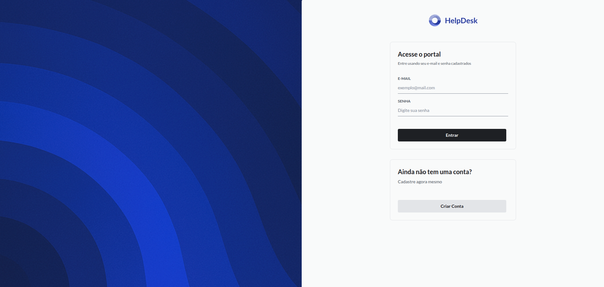
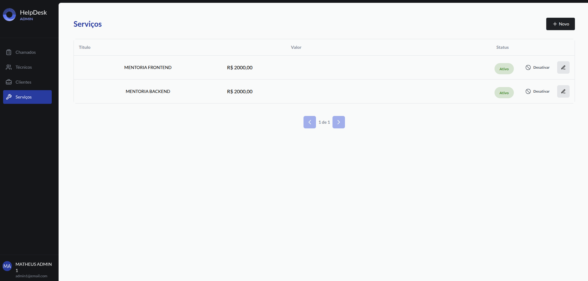
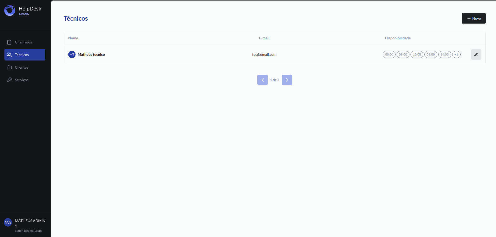
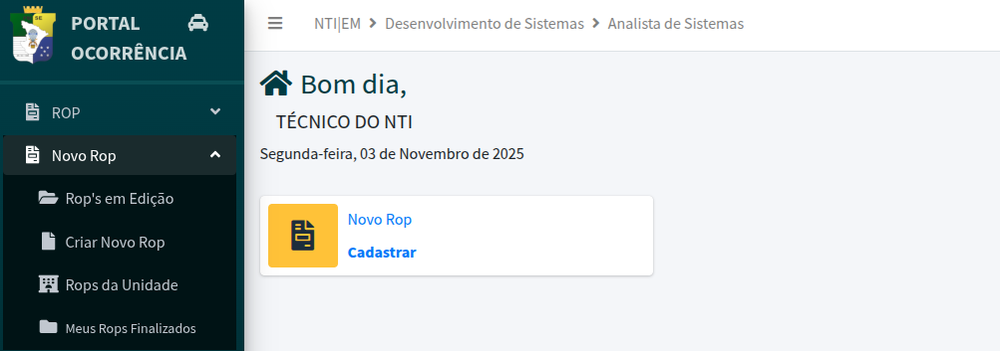
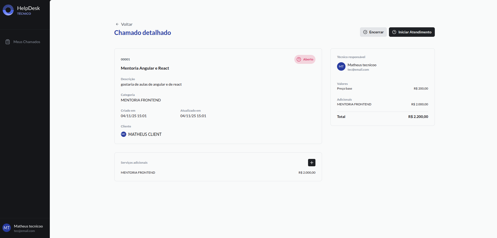
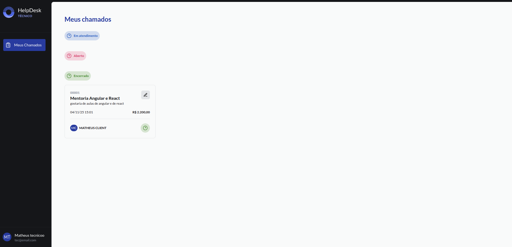
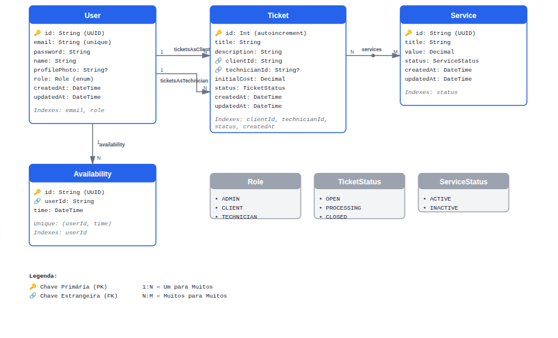

# 🖥️ Help-Desk

Gerenciador de Chamados replica o ciclo de vida completo de uma solicitação (abertura, acompanhamento e encerramento), permitindo a interação direta entre Administradores, Técnicos e Clientes.

--

## 💡 Funcionalidades

-  Autenticação com JWT
- Upload de imagem de perfil (Cliente e Técnico)
- Painéis distintos para Admin, Técnico e Cliente
- Criação e gestão de chamados com valores de serviços
- Alteração de status do chamado (Aberto | Em atendimento | Encerrado)
- Mobile First (responsivo)
- Os chamados são distribuídos automaticamente para o técnico disponível com menos atendimentos em andamento.

--

## ⚡ Tecnologias

- ⚡ Vite
- ⚛️ React
- 🎨 TailwindCSS
- 🔒 Validação com Zod

- 🟩 Node.js + Express
- 🛢 PostgreSQL
- 🔗 ORM: Prisma
- 🔒 JWT para autenticação
- 🐳 Docker

---

## 🎬 Preview

<details>
  <summary>Clique para abrir screenshots</summary>

  <br />

  
   
     
   
   
   
 
 
 

</details>

---

## 🛠 Como rodar o projeto localmente

### 1. Clone o repositório

```bash
git clone 
cd helpdesk
```

### 2. Backend

```bash
cd api
docker-compose up
npx prisma generate dev
npm install
npm run dev
```

### 3. Frontend

```bash
cd web
npm install
npm run dev
```

### 4. Acesse

👉 Frontend: [http://localhost:5173](http://localhost:5173)
👉 Backend: [http://localhost:3333](http://localhost:3333)

---